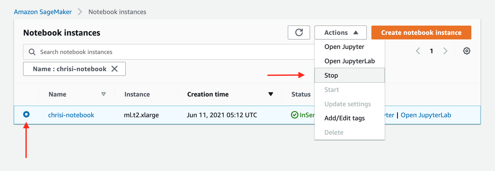
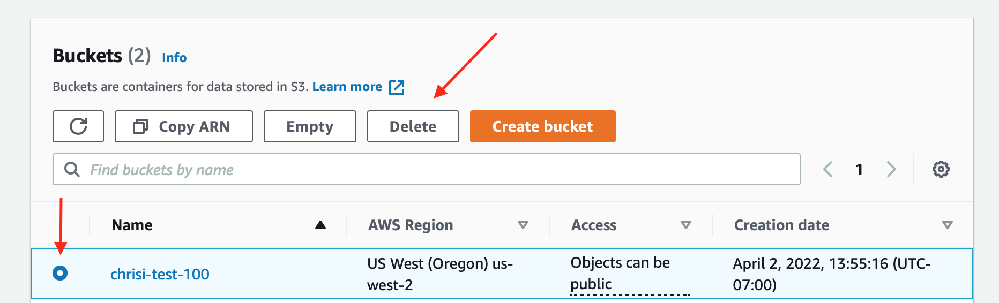

:pushpin:
# Hands-on ML Workshop by SAP Concur Data Science Team

## Welcome

In this workshop, you will go through every stage of the process of developing a machine learning model and preparing it for deployment into cloud as a micro-service. Especially, from Session 3 to Session 8, you will gather the data, create manual labeling job for the data with missing labels, train a ML model and create and optimize a Flask-based micro-service around it.

To complete this workshop, you will need:

- AWS account **Note that this workshop will incur charges in your AWS account. Please submit your AWS bill for reimbursement in your own cost center. We will instruct you to delete all the instances you created through this workshop to avoid unnecessary charges.**
- A local conda enrivonment
- A Github account
- Passion to learn!

We will use Twitter sentiment analysis project as an example for this workshop. But after this workshop, you will be able to go through this process for any machine learning use case!

## Course Structure

This workshop series is designed so that you can jump in on any session if you miss the previous session. But before joining the next session, go to the previous session's Git folder and complete the tasks at the end of its README. Then you will be set up for the next session.

### Session 1 Intro by Jesper Lind (Day 1)

- Introduction to the workshop framework
- Brief introduction of ML at SAP Concur
- Overview of the ML lifecycle
- Hands-on: Warm-up with a quick exercise using Python: predicting big mac price in 2030

### Session 2 Technical Set-up at SAP Concur & Workshop Prep by Mengyuan Liu (Day 1)

- Detailed introduction of tech stack at SAP Concur data science domain
- Hands-on: set up your environment for this workshop. Note: the detailed instruction can also be found below if you can't make it to this session.

### Session 3 Data Prep by Anupam Dewan (Day 2)

- Hands-on: prep your centralized data storage using AWS Glue, Athena and S3

### Session 4 Data Labeling by Hongyan Li (Day 2)

- Hands-on: create a manual labeling job using AWS Sagemaker Groundtruth
- Hands-on: collect newly labeled data using AWS Athena and S3

### Session 5 Model Building by Adithya Kumar (Day 3)

- Hands-on: prototype a sentiment analysis model using AWS Sagemaker using data prepped in Session 3
- Knowledge on tf-idf, random forest and recurrent neural network (RNN)
- Hands-on: use Quicksight to track offline and online metrics for model evaluation

### Session 6 Model Training Automation by Chris Ismael (Day 3)

- Hands-on: make your model training script re-usable using AWS Sagemaker Processing and Estimator jobs
- Use AWS Sagemaker for ML training automation

### Session 7 Service Building by Mike Stark (Day 4)

- Hands-on: create a Flask-based REST API for serialized RNN model from Session 5
- Hands-on: create a docker image of the service
- Hands-on: run service locally
- Overview of deployment pipeline at SAP Concur


### Session 8 Service Performance Tuning by Vladimir Valouch (Day 4)

- Hands-on: benchmark the service using Locust
- Hands-on: optimize the service created in Session 7 by using tf-serving


## What to Prep Before the Workshop

### Set up a Google Colab account in your browser

Due to Anaconda community edition not approved by SAP we will be using Google Colab, so make sure to have Google Colab set up (https://colab.research.google.com/)


### Github repo

Please clone https://github.com/ConcurDataScience/ConcurMLWorkshop.git to your local by:

`git clone https://github.com/ConcurDataScience/ConcurMLWorkshop.git`

### Create an AWS account

Create an AWS account for personal use. It will ask for your payment information. As previously stated, the bill occurred during this workshop can be reimbursed through your own cost center. Generally speaking, the cost shouldn't exceed $50.

Instructions: https://aws.amazon.com/premiumsupport/knowledge-center/create-and-activate-aws-account/

After creating, you can go to Billing Dashboard to see your current running instances.


### Set up your AWS environment
We will also cover this in Session 2 of Day 1. If you can't make it to the session, please complete this before starting D2 or Session 3.

Please make sure use "US West (Oregon) as your region for all the stesp below.


#### Set up IAM role

1. Go to AWS IAM.

2. Under "Roles" tab, you will see several basic roles already exist. Click on "Create role".

3. Follow the following setup to create your role.

4. Attach policies to your role. You should have the following policies at the end.

5. Use "ConcurMLWorkshopUse" as your role name and add "Description" as you wish. Then in the "Select trusted entities", edit the json to match below.


6. Then create role.

#### Create a S3 bucket for raw data

1. Go to AWS S3.

2. Click on "Create bucket" and use the following setup to create bucket. In Session 3, you will upload some pre-prepared data into this bucket.

3. Go into your bucket, and "Create folder" with name "athena_log". We will use this folder in the future.

## Create a AWS Sagemaker Instance
1. Go to AWS Sagemaker, choose "Notebook" on the left panel and click "Create a New Instance".
2. Follow the settings below to set up your notebook instance. Make sure to use the IAM role you set up earlier.


### Create a QuickSight account
1. Go to AWS Quicksight


2. If you don't already have a Quicksight account, follow the settings below to create your Quicksight account. We will use this in Session 5. This will incur charge in your AWS account, but very minimal. Again, please submit your cost for attending this workshop for reimbursement from your own cost center.

   It defaults to an "Enterprise" account, but click "Standard" to choose a standard one.

  

  

  


### Set up your computer local

#### Python environment
- Make sure your local python environment is 3.8
  If you are unable to install Anaconda due to licensing issue, please follow the instructions below to set up your python environment:
  - For linux, install using apt-get install python3: https://phoenixnap.com/kb/how-to-install-python-3-ubuntu
  - Fpr mac, install using brew. https://docs.python-guide.org/starting/install3/osx/
  - For windows, install the binary from https://www.python.org/downloads/ and add that into PATH
  - After installing Python, use venv to create an empty python environemnt:
     ```
     pip install virtualenv
     python3 -m venv env
     source env/bin/activate
     ```
- Your preferred Python IDE, such as VSCode, PyCharm etc

#### Install Docker
Install Docker from `https://docs.docker.com/get-docker/`

**Note: Docker now needs licenses to run on SAP laptops. If you don't currently have a Docker license through SAP, you can download the docker to your own personal laptop for personal use for free. See `https://www.docker.com/pricing/` for more information. For this workshop, you will need Docker on Day 4 and it needs to on the same laptop with Python 3.8 environment, IDE and Postman.**

#### Install Postman
Install Postman from `https://www.postman.com/downloads/`


# Delete AWS Resources After the Workshop
During the workshop, we will walk you through all the steps needed to delete all the AWS resources so that you don't get charged accidently.

If you are following this tutorial on your own pace, please make sure to delete all the following resources:

**( For AWS CLI commands you can either use Sagemaker Terminal, Sagemaker Notebook by adding `!` infront of the commands, or launching a AWS cloudshell)**

For cloud shell see how to launch that below:

  From the top right you should see this shell like icon ( in red box)


click on that, this should launch a cloudshell env like this, here you can run your aws cli commands.


  - After Session 3: delete Glue dev end-point, Glue notebook
    - [x] Delete Glue Dev Endpoint
          - `aws glue delete-dev-endpoint --endpoint-name {endpoint_name}`
    - [x] Delete Glue Notebook
          - `aws sagemaker delete-notebook-instance --notebook-instance-name {glue_notebook_name}`
    - [x] Delete Glue Job(if created)
          - `aws glue   delete-job --job-name {glue_job_name}`
    - [x] Delete Glue Job Trigger(if created)
          - `aws glue delete-trigger --name {glue_trigger_name}`
          
- After Session 4: stop Ground Truth job and delete the associated IAM roles and IAM policies

- After Session 5: delete Quicksight account and associated IAM roles and IAM policies

- After Session 6: Glue DB/Tabl/Crawler, Athena tables , stop and delete Sagemaker instances, S3 bucket and IAM role created during session 2
    - [x] Delete Glue Table
          - `aws glue delete-table --database-name {database_name} --name {table_name}`
    - [x] Delete Glue DB
          - `aws glue delete-database --name {database_name}`
    - [x] Delete Glue Crawler
          - `aws glue delete-crawler --name {crawler_name}`
    - [x] Delete Athena Tables:
    - [x] Delete/Stop All Sagemaker Instances
          - Click [here](https://us-west-2.console.aws.amazon.com/sagemaker/home?region=us-west-2#/notebook-instances) to show your notebook instances
          - Click "Stop" to stop your notebook instance, as in the image below
          - 
    - [x] Delete S3 Bucket:
          - Click [here](https://s3.console.aws.amazon.com/s3/buckets?region=us-west-2) to list your S3 buckets
          - Click "Delete" to delete your S3 bucket, as in the image below
          - 
    - [x] Delete IAM role


# Contact Us
Feel free to reach out if you have any questions or feedbacks. We'd love to hear from you if you use some of the material we prepared. Please find our contact info below.

SAP Slack Channel: #ask-datascience

Work Emails of Instructors:
- Jesper Lind, Director of Data Science: jesper.lind@sap.com
- Mengyuan Liu, Data Science Manager: mengyuan.liu@sap.com
- Anupam Dewan, Senior Data Scientist: anupam.dewan@sap.com
- Hongyan Li, Senior Developer: hongyan.li01@sap.com
- Adithya Kumar, Senior Data Scientist: adithya.kumar@sap.com
- Chris Ismael, Senior Developer: chris.ismael@sap.com
- Mike Stark, Data Science Manager: mike.stark@sap.com
- Vladimir Valouch, Principal Data Scientist: vladimir.valouch@sap.com
