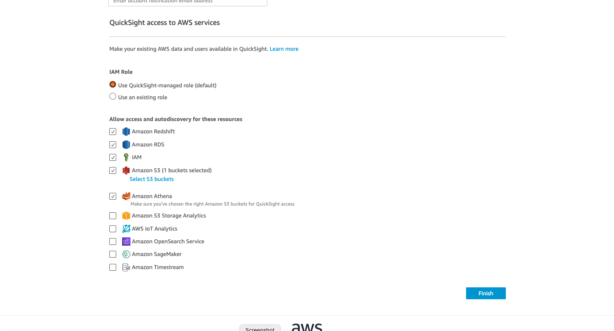

# Hands-on ML Workshop by SAP Concur Data Science Team

## Welcome

In this workshop, you will go through every stage of the process of developing a machine learning model and preparing it for deployment into cloud as a micro-service. Especially, from Session 3 to Session 8, you will gather the data, create manual labeling job for the data with missing labels, train a ML model and create and optimize a Flask-based micro-service around it.

To complete this workshop, you will need:

- AWS account **Note that this workshop will incur charges in your AWS account. Please submit your AWS bill for reimbursement in your own cost center. We will instruct you to delete all the instances you created through this workshop to avoid unnecessary charges.**
- A local conda enrivonment
- A Github account
- Passion to learn!

We will use Twitter sentiment analysis project as an example for this workshop. But after this workshop, you will be able to go through this process for any machine learning use case!

## Course Structure

This workshop series is designed so that you can jump in on any session if you miss the previous session. But before joining the next session, go to the previous session's Git folder and complete the tasks at the end of its README. Then you will be set up for the next session.

### Session 1 Intro by Jesper Lind (Day 1)

- Introduction to the workshop framework
- Brief introduction of ML at SAP Concur
- Overview of the ML lifecycle
- Hands-on: Warm-up with a quick exercise using Python: predicting big mac price in 2030

### Session 2 Technical Set-up at SAP Concur & Workshop Prep by Mengyuan Liu (Day 1)

- Detailed introduction of tech stack at SAP Concur data science domain
- Hands-on: set up your environment for this workshop. Note: the detailed instruction can also be found below if you can't make it to this session.

### Session 3 Data Prep by Anupam Dewan (Day 2)

- Hands-on: prep your centralized data storage using AWS Glue, Athena and S3

### Session 4 Data Labeling by Hongyan Li (Day 2)

- Hands-on: create a manual labeling job using AWS Sagemaker Groundtruth
- Hands-on: collect newly labeled data using AWS Glue, Athena and S3

### Session 5 Model Building by Adithya Kumar (Day 3)

- Hands-on: prototype a sentiment analysis model using AWS Sagemaker using data prepped in Session 3
- Knowledge on tf-idf, random forest and recurrent neural network (RNN)
- Hands-on: use Quicksight to track offline and online metrics for model evaluation

### Session 6 Model Training Automation by Chris Ismael (Day 3)

- Hands-on: make your model training script re-usable using AWS Sagemaker Processing and Estimator jobs
- Other tools for ML training automation

### Session 7 Service Building by Mike Stark (Day 4)

- Hands-on: create a Flask-based service for serialized RNN model from Session 5
- Hands-on: create a docker image of the service
- Hands-on: run service locally

### Session 8 Service Optimization by Vladimir Valouch & Renan Barreto (Day 4)

- Hands-on: optimize the service created in Session 7 by using tf-serving
- Hands-on: benchmark the service using Locust

## What to Prep

### Github repo

Please clone https://github.com/ConcurDataScience/ConcurMLWorkshop.git to your local by:

`git clone https://github.com/ConcurDataScience/ConcurMLWorkshop.git`

### Create an AWS account

Create an AWS account for personal use. It will ask for your payment information. As previously stated, the bill occurred during this workshop can be reimbursed through your own cost center. Generally speaking, the cost shouldn't exceed $50.  

After creating, you can go to Billing Dashboard to see your current running instances.

### Set up your AWS environment 
We will also cover this in Session 2 of Day 1. If you can't make it to the session, please complete this before starting D2 or Session 3.

#### Set up IAM role

1. Go to AWS IAM.

2. Under "Roles" tab, you will see several basic roles already exist. Click on "Create role".

3. Follow the following setup to create your role.

Attach policies to your role. You should have the following policies at the end.

Use "ConcurMLWorkshopUse" as your role name and add "Description" as you wish. Then in the "Select trusted entities", edit the json to match below.

Then create role.

#### Create a S3 bucket for raw data

1. Go to AWS S3.

2. Click on "Create bucket" and use the following setup to create bucket. In Session 3, you will upload some pre-prepared data into this bucket.

3. Go into your bucket, and "Create folder" with name "athena_log". We will use this folder in the future.

### Create a QuickSight account
1. Go to AWS Quicksight

2. If you don't already have a Quicksight account, follow the settings below to create your Quicksight account. We will use this in Session 5. This will incur charge in your AWS account, but very minimal. Again, please submit your cost for attending this workshop for reimbursement from your own cost center.

